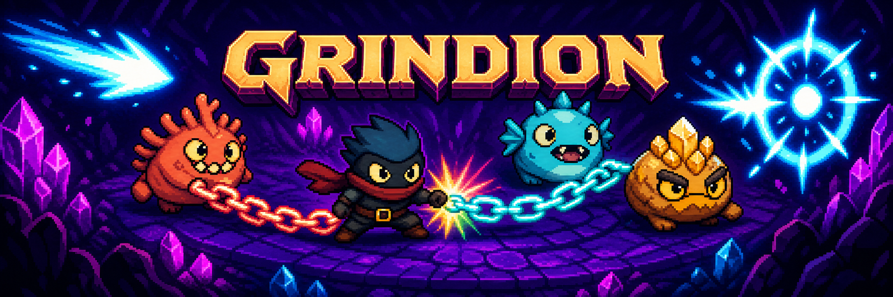

<p align="center">
  
</p>

<p align="center">
  <strong>Chain monsters. Choose your payoff. Spend everything.</strong>
  <br />
  A shared-board puzzle brawler where greed is a route, Power is a promise, and every shot leaves you exposed.
</p>

<p align="center">
  
  
  
  
  
  <a href="https://github.com/ThatXliner/Grindion/actions/workflows/ci.yml"></a>
</p>

## What is Grindion?

Grindion is a competitive `.io` puzzle-combat game played on one continuously replenishing monster field. Drag through matching creatures to move and build a chain, then make the choice that drives the whole game:

- **Bank Score** to grow tougher, heal, and reach farther.
- **Forge Power** to arm one dodgeable, parryable, all-in projectile.

Firing empties your entire Power reserve. If the shot misses—or gets parried—you have just announced to the arena that you cannot defend. Long chains are lucrative, but they also make your route obvious and lock you out of attacking or parrying until you commit or cancel.

> [!NOTE]
> This repository is a **playable, desktop-first vertical slice**: a fixed-seed seven-lesson tutorial plus a five-minute arena against seven bots. Real-time human multiplayer is the next architectural step, not a feature being claimed today.

## Why it hits

| System                 | The interesting decision                                                               |
| ---------------------- | -------------------------------------------------------------------------------------- |
| **Shared chains**      | Route greedily through one live board while rivals compete for the same monsters.      |
| **Score vs. Power**    | Invest in lasting reach and health, or trade the chain for immediate threat.           |
| **Rainbow Grindstone** | Chain five of one color to unlock a one-use switch into any adjacent color.            |
| **All-in shots**       | Every projectile spends the full reserve, turning each attack into a commitment.       |
| **Timing parries**     | A well-timed defense nullifies any shot, regardless of how powerful the attacker is.   |
| **Comeback pressure**  | Leaders grow with diminishing returns while lower-Score players generate Power faster. |

## Play it locally

You will need a current Node.js LTS release and npm. Node 22 is recommended.

```bash
git clone https://github.com/ThatXliner/Grindion.git
cd Grindion
npm install
npm run dev
```

Open the local URL printed by Vite, then start with **Play Tutorial** or jump directly into **Enter Arena**. Supabase is optional; the full prototype works without it.

## Controls

| Input                                                                  | Action                                              |
| ---------------------------------------------------------------------- | --------------------------------------------------- |
| <kbd>Left drag</kbd> from your hero through matching adjacent monsters | Build a route and chain                             |
| Release                                                                | Move to the chain endpoint and bank Score           |
| <kbd>Shift</kbd> + release                                             | Move to the endpoint and convert the chain to Power |
| Hold <kbd>Right mouse</kbd>                                            | Aim, scout, and zoom out                            |
| Release <kbd>Right mouse</kbd>                                         | Fire every point of stored Power                    |
| <kbd>Space</kbd>                                                       | Parry an incoming projectile                        |
| <kbd>Escape</kbd>                                                      | Cancel the active chain                             |

### The loop in 20 seconds

1. Start next to a monster and drag through adjacent creatures of the same color.
2. Release normally for Score, or hold <kbd>Shift</kbd> while releasing for Power.
3. Keep chaining one color to prime a rainbow color switch after five monsters.
4. Spend Power on a predicted shot—or save enough to parry.
5. Never forget: while you are chaining, you are vulnerable; after you fire, you are empty.

## Built like a multiplayer game, even before multiplayer

The rules live in a deterministic, fixed-step TypeScript simulation. The Svelte client renders snapshots on canvas and submits intent objects—the same boundary a future authoritative match worker can consume.

```text
Pointer / keyboard
       │
       ▼
  player intents ──► deterministic game step ──► events + snapshot
                              │                         │
                              │                         ▼
                              └──────────────► canvas, HUD, audio-ready hooks

Supabase: profiles + match metadata + final results
Future match worker: movement + chains + combat + authoritative state
```

This split keeps per-frame combat out of Postgres and Presence, while preserving Supabase for the durable data it is good at. The local game remains fully functional when Supabase is not configured.

## Project map

```text
src/
├── lib/game/              deterministic rules, bots, tutorial, tuning, tests
├── lib/supabase/          optional browser client boundary
└── routes/+page.svelte    canvas renderer, HUD, input, tutorial presentation

static/assets/             banner and original pixel-art sprite sheets
supabase/migrations/       match metadata schema and RLS policies
GAME_DESIGN.md             complete rules, pillars, scope, and architecture
```

Start with [`GAME_DESIGN.md`](./GAME_DESIGN.md) for the full combat model and design rationale. The core simulation entry points are in [`src/lib/game`](./src/lib/game).

## Verification

```bash
npm run lint
npm run check
npm run test:unit -- --run
npm run test:e2e
npm run build
```

The suite covers deterministic engine rules, bot behavior, chain conflicts, the Grindstone switch, tutorial progression, and the browser-level arena flow.

GitHub Actions runs the quality, unit, browser, and production-build checks on every pull request and every push to `main`. Failed browser runs retain a Playwright HTML report for 14 days.

## Optional Supabase setup

Copy the example environment file and add the browser-safe values for your project:

```bash
cp .env.example .env
```

```dotenv
PUBLIC_SUPABASE_URL=your-project-url
PUBLIC_SUPABASE_PUBLISHABLE_KEY=your-publishable-key
```

Never expose a secret or service-role key through `PUBLIC_*`.

For a local Supabase stack (Docker required):

```bash
npx supabase start
npx supabase db reset
npx supabase status
```

Use the API URL and publishable/anon key reported by `supabase status`. Client-facing writes are protected by RLS; final results intentionally have no client write policy and are reserved for the future authoritative game service.

## Current frontier

The prototype has the core loop, bots, tutorial, readable combat, progression curves, death/respawn, leaderboard, and tests. The big next moves are server-authoritative live matches, network snapshot interpolation, mobile/controller input, matchmaking, and another hard round of tuning.

If you are changing rules, keep the simulation deterministic, add the engine-level test first, and update [`GAME_DESIGN.md`](./GAME_DESIGN.md) when the design contract changes.

---

<p align="center">
  <strong>Greed has a cost. Make the chain worth it.</strong>
</p>
